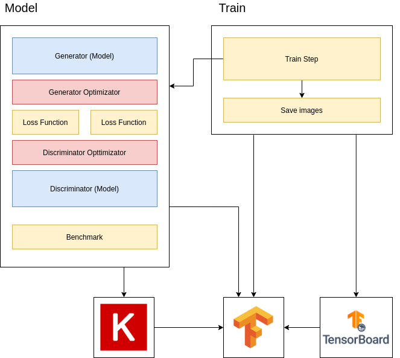
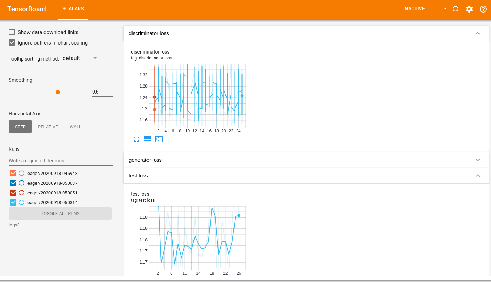
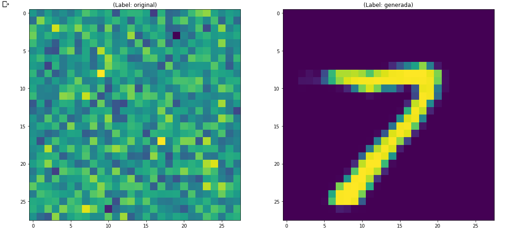

## Taller de construcción de Redes Generativas Antagónicas (RGAs)
### 
Machine Learning, Aprendizaje Automático, TensorFlow, TensorBoard, Keras, Redes de Neuronas, GAN Networks. 

## Ejercicio 3 - Construcción de una red de neuronas para la generación de números manuscritos

El objetivo de este ejercicio es construir una Red Generativa Antagónica (RGA) a partir de ejemplos aleatorios o imágenes existentes. Para ello vamos a basar este taller en una serie de talleres previos creados por Google. El objetivo de este taller es crear un sistema compuesto por lo siguientes componentes:



* Model: Es una clase que contendrá todos los elementos de la RGA a construir. En este caso nuestro modelo estará a su vez formado por dos modelos de red de neuronas de tipo convolucional, ya que nuestro objetivo es generar imágenes que representan a caracteres numéricos. 
* Train: Es un proceso de utilizará el modelo para entrenar los diferentes componentes que se encuentran definidos en el modelo. 

**Paso 1 - Instalando paquetes en Notebooks**

Los notebooks son entidades independientes que permiten la utilización de cualquier tipo de páquete python y para ellos nos ofrece la posibilidad de instalar paquete mediante la utilización de la sistema de instalación de paquetes pip. En el caso de que estés utilizando un Jupyter Notebook es necesario realizar la instalación de ciertos paquetes mediante los siguiente comandos:

```
!sudo apt update
!pip install tensorflow matplotlib numpy Pillow==2.2.2 keras
```

Como podemos observar, es necesario incluir el caracter __!__ antes del comando de instalación. A continuación hay que seleccionar el fragmento y pulsar la tecla play para ejecutar el código contenido en el fragmento. Si ejecutamos estos comandos en el entorno colaborate observaremos la siguiente salida:

```
Requirement already satisfied: tensorflow in /usr/local/lib/python3.6/dist-packages (2.3.0)
Requirement already satisfied: matplotlib in /usr/local/lib/python3.6/dist-packages (3.2.2)
Requirement already satisfied: numpy in /usr/local/lib/python3.6/dist-packages (1.18.5)
Requirement already satisfied: Pillow in /usr/local/lib/python3.6/dist-packages (2.2.2)
Requirement already satisfied: keras in /usr/local/lib/python3.6/dist-packages (2.4.3)
Requirement already satisfied: six>=1.12.0 in /usr/local/lib/python3.6/dist-packages (from tensorflow) (1.15.0)
Requirement already satisfied: scipy==1.4.1 in /usr/local/lib/python3.6/dist-packages (from tensorflow) (1.4.1)
Requirement already satisfied: h5py<2.11.0,>=2.10.0 in /usr/local/lib/python3.6/dist-packages (from tensorflow) (2.10.0)
Requirement already satisfied: tensorboard<3,>=2.3.0 in /usr/local/lib/python3.6/dist-packages (from tensorflow) (2.3.0)
Requirement already satisfied: wheel>=0.26 in /usr/local/lib/python3.6/dist-packages (from tensorflow) (0.35.1)
Requirement already satisfied: absl-py>=0.7.0 in /usr/local/lib/python3.6/dist-packages (from tensorflow) (0.10.0)
Requirement already satisfied: opt-einsum>=2.3.2 in /usr/local/lib/python3.6/dist-packages (from tensorflow) (3.3.0)
Requirement already satisfied: gast==0.3.3 in /usr/local/lib/python3.6/dist-packages (from tensorflow) (0.3.3)
Requirement already satisfied: keras-preprocessing<1.2,>=1.1.1 in /usr/local/lib/python3.6/dist-packages (from tensorflow) (1.1.2)
Requirement already satisfied: tensorflow-estimator<2.4.0,>=2.3.0 in /usr/local/lib/python3.6/dist-packages (from tensorflow) (2.3.0)
Requirement already satisfied: grpcio>=1.8.6 in /usr/local/lib/python3.6/dist-packages (from tensorflow) (1.32.0)
Requirement already satisfied: google-pasta>=0.1.8 in /usr/local/lib/python3.6/dist-packages (from tensorflow) (0.2.0)
Requirement already satisfied: wrapt>=1.11.1 in /usr/local/lib/python3.6/dist-packages (from tensorflow) (1.12.1)
Requirement already satisfied: termcolor>=1.1.0 in /usr/local/lib/python3.6/dist-packages (from tensorflow) (1.1.0)
Requirement already satisfied: astunparse==1.6.3 in /usr/local/lib/python3.6/dist-packages (from tensorflow) (1.6.3)
Requirement already satisfied: protobuf>=3.9.2 in /usr/local/lib/python3.6/dist-packages (from tensorflow) (3.12.4)
Requirement already satisfied: pyparsing!=2.0.4,!=2.1.2,!=2.1.6,>=2.0.1 in /usr/local/lib/python3.6/dist-packages (from matplotlib) (2.4.7)
Requirement already satisfied: python-dateutil>=2.1 in /usr/local/lib/python3.6/dist-packages (from matplotlib) (2.8.1)
Requirement already satisfied: cycler>=0.10 in /usr/local/lib/python3.6/dist-packages (from matplotlib) (0.10.0)
Requirement already satisfied: kiwisolver>=1.0.1 in /usr/local/lib/python3.6/dist-packages (from matplotlib) (1.2.0)
Requirement already satisfied: pyyaml in /usr/local/lib/python3.6/dist-packages (from keras) (3.13)
Requirement already satisfied: tensorboard-plugin-wit>=1.6.0 in /usr/local/lib/python3.6/dist-packages (from tensorboard<3,>=2.3.0->tensorflow) (1.7.0)
Requirement already satisfied: google-auth<2,>=1.6.3 in /usr/local/lib/python3.6/dist-packages (from tensorboard<3,>=2.3.0->tensorflow) (1.17.2)
Requirement already satisfied: google-auth-oauthlib<0.5,>=0.4.1 in /usr/local/lib/python3.6/dist-packages (from tensorboard<3,>=2.3.0->tensorflow) (0.4.1)
Requirement already satisfied: markdown>=2.6.8 in /usr/local/lib/python3.6/dist-packages (from tensorboard<3,>=2.3.0->tensorflow) (3.2.2)
Requirement already satisfied: setuptools>=41.0.0 in /usr/local/lib/python3.6/dist-packages (from tensorboard<3,>=2.3.0->tensorflow) (50.3.0)
Requirement already satisfied: werkzeug>=0.11.15 in /usr/local/lib/python3.6/dist-packages (from tensorboard<3,>=2.3.0->tensorflow) (1.0.1)
Requirement already satisfied: requests<3,>=2.21.0 in /usr/local/lib/python3.6/dist-packages (from tensorboard<3,>=2.3.0->tensorflow) (2.23.0)
Requirement already satisfied: rsa<5,>=3.1.4; python_version >= "3" in /usr/local/lib/python3.6/dist-packages (from google-auth<2,>=1.6.3->tensorboard<3,>=2.3.0->tensorflow) (4.6)
Requirement already satisfied: pyasn1-modules>=0.2.1 in /usr/local/lib/python3.6/dist-packages (from google-auth<2,>=1.6.3->tensorboard<3,>=2.3.0->tensorflow) (0.2.8)
Requirement already satisfied: cachetools<5.0,>=2.0.0 in /usr/local/lib/python3.6/dist-packages (from google-auth<2,>=1.6.3->tensorboard<3,>=2.3.0->tensorflow) (4.1.1)
Requirement already satisfied: requests-oauthlib>=0.7.0 in /usr/local/lib/python3.6/dist-packages (from google-auth-oauthlib<0.5,>=0.4.1->tensorboard<3,>=2.3.0->tensorflow) (1.3.0)
Requirement already satisfied: importlib-metadata; python_version < "3.8" in /usr/local/lib/python3.6/dist-packages (from markdown>=2.6.8->tensorboard<3,>=2.3.0->tensorflow) (1.7.0)
Requirement already satisfied: certifi>=2017.4.17 in /usr/local/lib/python3.6/dist-packages (from requests<3,>=2.21.0->tensorboard<3,>=2.3.0->tensorflow) (2020.6.20)
Requirement already satisfied: chardet<4,>=3.0.2 in /usr/local/lib/python3.6/dist-packages (from requests<3,>=2.21.0->tensorboard<3,>=2.3.0->tensorflow) (3.0.4)
Requirement already satisfied: idna<3,>=2.5 in /usr/local/lib/python3.6/dist-packages (from requests<3,>=2.21.0->tensorboard<3,>=2.3.0->tensorflow) (2.10)
Requirement already satisfied: urllib3!=1.25.0,!=1.25.1,<1.26,>=1.21.1 in /usr/local/lib/python3.6/dist-packages (from requests<3,>=2.21.0->tensorboard<3,>=2.3.0->tensorflow) (1.24.3)
Requirement already satisfied: pyasn1>=0.1.3 in /usr/local/lib/python3.6/dist-packages (from rsa<5,>=3.1.4; python_version >= "3"->google-auth<2,>=1.6.3->tensorboard<3,>=2.3.0->tensorflow) (0.4.8)
Requirement already satisfied: oauthlib>=3.0.0 in /usr/local/lib/python3.6/dist-packages (from requests-oauthlib>=0.7.0->google-auth-oauthlib<0.5,>=0.4.1->tensorboard<3,>=2.3.0->tensorflow) (3.1.0)
Requirement already satisfied: zipp>=0.5 in /usr/local/lib/python3.6/dist-packages (from importlib-metadata; python_version < "3.8"->markdown>=2.6.8->tensorboard<3,>=2.3.0->tensorflow) (3.1.0)
```

En este caso no se ha realizado la instalación de ningún paquete debido a que todos los paquetes necesarios ya estaban instalados en el servidor Jupyter. 

**Paso 2 - Iniciando TensorBoard**

A continuación vamos a incluir un comando que permite cargar la extensión de TensorFlow Board dentro de los cuadernos de tipo Jupyter, de forma que se despligue de manera embebida en el entorno.

```
%load_ext tensorboard
```
**Paso 3 - Importando Paquetes**

Una vez que se ha realizado la instalación de los diferentes paquetes python, es necesario importar aquellas clases y métodos necesarios para la realización del ejercicio.

```
import tensorflow as tf
import matplotlib.pyplot as plt
import numpy as np
import os
import PIL
import time
import datetime

from PIL import Image
from IPython import display
from keras.callbacks import TensorBoard
from keras.models import Sequential
from keras.layers import Dense, BatchNormalization, LeakyReLU, Reshape, Conv2DTranspose, Conv2D, Dropout, Flatten
from keras import optimizers

```

Para el desarrollo de los diferentes ejercicios vamos a necesitar un conjunto de liberías que servirán para lo siguiente:

* tensorflow: Nos ofrece funciones para la construcción de los modelos de Machine Learning. 
* numpy: Nos ofrece funciones para la manipulación de arrays y conjunto de datos. 
* matplotlib: Nos ofrece funciones para la visualización de datos. 
* tensorflow: Nos ofrece funciones para la construacción de procesos de entrenamiento. 
* os: Nos ofrece funciones para la manipulación de recursos del sistema operativo. 
* math: Nos ofrece funciones para la realización de operaciones matemáticas complejas (no elementales).
* time: Nos ofrece funciones para la obtención de information referente al tiempo, para crear contadores o archivos de log.
* Keras.model: Nos permite utilizar diferentes tipo de modelos, en este caso vamos a utilizar el modelo secuencial.
* Keras.layers: Nos permite utilizar diferentes tipo de capas para incluir en una red de neuronas.
* optimizers from keras: Nos permite utilizar diferentes tipos de algoritmos de optimización, en nuestro caso utilizaremos el optimizador de Adams.

**Paso 4 - Definición de variable globales**

Para la construcción de nuestra red RGA es necesario definir una serie de variables globales que utilizaremos a lo largo del notebook con el objetivo de simplificar los cambios que queramos realizar en el proceso de construcción de las redes. Las variables globales a definir son las siguientes:

```
BUFFER_SIZE = 60000
BATCH_SIZE = 256
WIDTH = 28
HEIGHT = 28
```

**Paso 5 - Carga de los datos**

Una vez que hayamos definido todos los elementos básicos necesarios para el taller vamos ha descargar nuestro datos. En este caso vamos a utilizar los datos de ejemplo almacenados en keras para la identificación de número manuscritos. Para ellos deberemos crear la siguiente función 

```
def generate_data_set(height, weight, normalization_value):
  (train_images, train_labels), (_, _) = tf.keras.datasets.mnist.load_data()
  train_images = train_images.reshape(train_images.shape[0], height, weight, 1).astype('float32')
  train_images = (train_images - normalization_value) / normalization_value
  return train_images, train_labels
```
Esta función crear un conjunto de datos y modificar el tamaño de las mismas en base al tamaño que queramos utilizar (reshape). Además permite normalizar el valor de los datos en base al escalado realizado en el proceso de reshape mediante la variable de normalización. Finalmente esta función nos devolverá dos conjunto de datos: (1) el conjunto de imágenes de entrenamiento; y (2) el conjunto de valores de test que nos indican que número se encuentra escrito en las imágenes. 

**Paso 6: Creación del modelo generador (Generator)**

A continuación podemos comenzar a crear le primera de las redes de neuronas necesarias para nuestro sistema. Esta red se corresponde con el generador que será la red que nos proveerá de ejemplos generados a partir de información aleatorios con el objetivo de conseguir generar ejemplos que se adapten a nuestras necesidades. Es decir, esta red es la que deber imitar el proceso de escritura manuscrita. La red está formada por las diferentes capas que se presentan en la imagen:


Esta red estará formada por 11 capas de las cuales 3 de ellas se corresponde con una función de activación y para su construcción crearemos una función que llamaremos en nuestra clase Model. A continuación se describen las diferentes capas:

* Capa Full-Connected (Dense)
* Capa Reshape (Reshape)
* Cada de transposición (Conv2DTranspose)
* Capa de activación ReLu (LeakyReLU)
* Capa de Normalización (BatchNormalization)

Para la definición del proceso de creación de la red de neuronas de generación (Generator) debemos crear una función denominada __build_generator_model__ que tendrán cuatro parámetros de entrada:

* name (string): Este parámetro se corresponde con el identificador del modelo. 
* height (int): Este parámetro se corresponde con la altura de la imagen. 
* width (int): Este parámetro se corresponde con la anchura de la imagen.
* dims (int): Se corresponde con el número de canales de la imagen. En este taller vamos a trabajar con imágenes en blanco y negro (monocromo) por lo que sólo tendremos un canal. 

```
def build_generator_model(name, height, width, dims=1):
    
    model = Sequential()
    model.add(Dense(7*7*256, use_bias=False, input_shape=(height*width, dims)))
    model.add(BatchNormalization())
    model.add(LeakyReLU())

    model.add(Reshape((7, 7, 256)))

    model.add(Conv2DTranspose(128, (5, 5), strides=(1, 1), padding='same', use_bias=False))
    model.add(BatchNormalization())
    model.add(LeakyReLU())

    model.add(Conv2DTranspose(64, (5, 5), strides=(2, 2), padding='same', use_bias=False))
    model.add(BatchNormalization())
    model.add(LeakyReLU())

    model.add(Conv2DTranspose(1, (5, 5), strides=(2, 2), padding='same', use_bias=False, activation='tanh'))

    return model
```

**Paso 7: Creación del modelo discriminador (Discriminator)**

A continuación podemos comenzar a crear le primera de las redes de neuronas necesarias para nuestro sistema. Esta red se corresponde con el generador que será la red que nos proveerá de ejemplos generados a partir de información aleatorios con el objetivo de conseguir generar ejemplos que se adapten a nuestras necesidades. Es decir, esta red es la que deber imitar el proceso de escritura manuscrita. La red está formada por las diferentes capas que se presentan en la imagen:


Esta red estará formada por 11 capas de las cuales 3 de ellas se corresponde con una función de activación y para su construcción crearemos una función que llamaremos en nuestra clase Model. A continuación se describen las diferentes capas:

* Capa Full-Connected (Dense)
* Capa Reshape (Reshape)
* Cada de convolución de dos dimensiones (Conv2D)
* Capa de despliegue de la función de activación ReLu (LeakyReLU)
* Capa de Dropout (Dropout)
* Capa de aplanamiento (Flatten)

Para la definición del proceso de creación de la red de neuronas de discrimización (discriminator) debemos crear una función denominada __build_discriminator_model__ que tendrán tres parámetros de entrada:

* name (string): Este parámetro se corresponde con el identificador del modelo. 
* height (int): Este parámetro se corresponde con la altura de la imagen. 
* width (int): Este parámetro se corresponde con la anchura de la imagen.
* dims (int): Se corresponde con el número de canales de la imagen. En este taller vamos a trabajar con imágenes en blanco y negro (monocromo) por lo que sólo tendremos un canal. 

```
def build_discriminator_model(name, height, width, dims):
    
    model = Sequential()
    
    model.add(Conv2D(64, (5, 5), strides=(2, 2), padding='same', input_shape=[height, width, dims]))
    model.add(LeakyReLU())
    model.add(Dropout(0.3))

    model.add(Conv2D(128, (5, 5), strides=(2, 2), padding='same'))
    model.add(LeakyReLU())
    model.add(Dropout(0.3))

    model.add(Flatten())
    model.add(Dense(1))

    return model
```

Como se puede observar esta red de neuronas es una red de neurona de tipo convolucional clásica para la identificación de la clase. Esta red será la que se utilizará para predecir si los ejemplos (imágenes) generados por nuestra red generadora con correcto o no enviado su feedback a esta red con el objetivo de mejorar el proceso de aprendizaje. 

**Paso 8 - Definición de la clase Model**

Para simplificar la creación de nuestro modelo, vamos a construir una clase para su manipulación. Para ello crearemos una clase en python denominada Model que tendrá ocho atributos:

* Red generadora (generator) que almacenará el modelo construido para la generación de los datos durante el proceso de entrenamiento.
* Red discriminadora (Discriminator) que almacenará el modelo construido para la eveluación de los datos en el proceso de entrenamiento. 
* Algoritmo de optimización del generador (generator_optimizer) que almacenará el algoritmo de optimización que será utilizado durante el proceso de entrenamiento de la red generadora. En este caso se utilizará el algoritmo de [Adam](https://arxiv.org/abs/1412.6980).
* Algoritmo de optimización del discriminador (discriminator_optimizer) que almacenará el algoritmo de optimización que será utilizado durante el proceso de entrenamiento de la red discriminadora. En este caso se utilizará el algoritmo de [Adam](https://arxiv.org/abs/1412.6980).
* Directorio de los punto de guardado (checkpoint_dir) que almacenará la ruta donde se almacenan las copias de seguridad de las redes durante el proceso de entrenamiento. 
* Prefijo para el nombrado de los fichero de punto de guardado (checkpoint_prefix) que almacenará el nombre que se incluirá en todos los fichero de tipo checkpoint. 
* El objeto para la creación de los puntos de guardado (checkpoint) que almacenará el objeto que permitirá crear los diferentes punto de guardado durante el proceso de entrenamiento. 

```
class Model:

  def __init__(self, height, width, dims):
  
    self.__generator = build_generator_model('generator_test', height, width, dims)
    self.__discriminator = build_discriminator_model('discriminator_test', height, width, dims)
    self.__cross_entropy = tf.keras.losses.BinaryCrossentropy(from_logits=True)

    self.__generator_optimizer = optimizers.Adam(1e-4)
    self.__discriminator_optimizer = optimizers.Adam(1e-4)

    self.__checkpoint_dir = './training_checkpoints'
    self.__checkpoint_prefix = os.path.join(checkpoint_dir, "ckpt")

    self.__checkpoint = tf.train.Checkpoint(generator_optimizer=generator_optimizer,
                                 discriminator_optimizer=discriminator_optimizer,
                                 generator=self.__generator,
                                 discriminator=self.__discriminator)
    
    self.__checkpoint.restore(tf.train.latest_checkpoint(self.__checkpoint_dir))
```

Al final del proceso de creación de las variables locales del modelo, el sistema comprobará si existen algún checkpoint previo con el objetivo de continuación el proceso de entrenamiento desde ahí. A continuación es necesario crear una serie de método para manipular los diferentes elementos del modelo:

El primer método o función se corresponde con la visualización de la estructura de la red de neuronas generadora que denominaremos __generator_summary__. 

```
  def generator_summary(self):
    return self.__generator.summary()
```
El segundo método o función se corresponde con la visualización de la estructura de la red de neuronas discriminadora que denominaremos __generator_summary__. 

```
  def discriminator_summary(self):
    return self.__discriminator.summary()   
```

El tercer método se corresponde con una propiedad que nos devolverá el modelo generador con el objetivo de utilizarlo. Este método se denominará __generator__. 

```
  @property
  def generator(self):
    return self.__generator
```

El cuarto método se corresponde con una propiedad que nos devolverá el modelo discriminador con el objetivo de utilizarlo. Este método se denominará __discriminator__. 

```
  @property
  def discriminator(self):
    return self.__discriminator
```

El quinto método se corresponde con una propiedad que nos devolverá el algoritmo de optimización utilizado para la red generadora. Este método se denominará __generator_optimizer__. 

```
  @property
  def generator_optimizer(self):
    return self.__generator_optimizer
```

El sexto método se corresponde con una propiedad que nos devolverá el algoritmo de optimización utilizado para la red discriminadora. Este método se denominará __discriminator_optimizer__. 

```
  @property
  def discriminator_optimizer(self):
    return self.__discriminator_optimizer 
```

El septimo método o función se corresponde con la función de los utilizada por la red discriminadora que denominaremos __discriminator_loss__. Esta función utilizará dos parámetros:

* real_output que se corresponde con el valor real al que se corresponde el valor de entrada (clase). 
* fake_output que se corresponde con el valor tras la realización del proceso de inferencia sobre la red discriminadora (clase). 

Esta función devolverá un valor entre 0 y 2.

```
  @tf.autograph.experimental.do_not_convert
  def discriminator_loss(self, real_output, fake_output):
    real_loss = self.__cross_entropy(tf.ones_like(real_output), real_output)
    fake_loss = self.__cross_entropy(tf.zeros_like(fake_output), fake_output)
    return real_loss + fake_loss
```

El octavo método o función se corresponde con la función de los utilizada por la red generadora que denominaremos __generator_loss__. Esta función utilizará un único parámetros:

* fake_output que se corresponde con el valor que se corresponde con el ejemplo generado por la red generadora. 

Esta función devolverá un valor entre 0 y 2.

```
  @tf.autograph.experimental.do_not_convert
  def generator_loss(self, fake_output):
    return self.__cross_entropy(tf.ones_like(fake_output), fake_output)
```
El noveno método o función se corresponde con la función dque generá los punto de guardado de la red durante el proceso de entrenamiento y  que denominaremos __create_checkpoint__.

```
  def create_checkpoint(self):
    self.__checkpoint.save(file_prefix = self.__checkpoint_prefix)
```

**Paso 9 - Definición de la función de generación de ejemplos y entrenamiento**

Una vez que hemos definido nuestro modelo tenemos que crear las diferentes funciones del proceso de entrenamiento. Para ello crearemos una función denominada __train_step__ de tipo tf.function (). Esta función recibirá 6 parámetros de entrada:

* model (Model) se corresponde con el modelo que está siendo entrenado.
* writer (TF Writer) se corresponde con el objeto utilizado para almacena la información para evaluación el proceso de entrenamiento. 
* images (Tensor Slices) se corresponde con las imágenes reales utilizadas para entrenar a la red discriminadora. 
* num_examples (int) se corresponde con el numero de imagenes que serán generado en pasa iteración de entrenamiento. 
* example_shape (tupple(int, int)) se corresponde con la estructura de la imagenes. 
* epoch (int) se corresponde con la iteración actual del proceso de entrenamiento. 

```
@tf.function
def train_step(model, writer, images, example_num, example_shape, epoch):
    
```
Definiremos un conjunto de ejemplos de tipo aleatorio

```
    examples = tf.random.normal([example_num, example_shape])
    
```
Ejecutaremos el proceso bajo el objeto writer con el objetivo de almacenar la información de la función de loss de las dos redes de neuronas. 
```
    with writer.as_default():
    
```
A su vez ejecutaremos el proceso bajo el objeto de tipo GradientTape con el objetivo de aplicar el algoritmo de optimización definido previamente en la clase Model. 
```
      with tf.GradientTape() as gen_tape, tf.GradientTape() as disc_tape:

```
Generaremos un conjunto de imagenes de tipo aleatorio y calcularemos los valores definidos por la red para la imágenes realizar y las falsas (generadas).
```
        generated_images = model.generator(examples, training=True)
        real_output = model.discriminator(images, training=True)
        fake_output = model.discriminator(generated_images, training=True)

```
A continuación calcularemos el valor de pérdida (loss) para cada una de las redes. 
```

        gen_loss = model.generator_loss(fake_output)
        disc_loss = model.discriminator_loss(real_output, fake_output)

```
Finalmente almacenaremos los valores de los en el writer para cada una de las redes de neuronas.  
```

      tf.summary.scalar("generator loss", gen_loss, step=epoch+1)
      tf.summary.scalar("discriminator loss", disc_loss, step=epoch+1)

```
Calcularemos los gradientes en base a los valores de loss obtenidos para cada red. 
```

      gradients_of_generator = gen_tape.gradient(gen_loss, model.generator.trainable_variables)
      gradients_of_discriminator = disc_tape.gradient(disc_loss, model.discriminator.trainable_variables)

```
Aplicaremos el algoritmo de optimización sobre los nuevos valores calculados. 
```

      model.generator_optimizer.apply_gradients(zip(gradients_of_generator, model.generator.trainable_variables))
      model.discriminator_optimizer.apply_gradients(zip(gradients_of_discriminator, model.discriminator.trainable_variables))
```

Además crearemos una función denominada ____call____ que nos permitirá calcular el valor de y para cada una de las x en base a los valores calculados. 

```
    def __call__(self, x):
      return tf.linalg.matmul(x, self.weights) + self.bias
```

y una función denominada add que nos permitirá añadir una nuevo valor a las diferentes métricas almacenadas en vars indicando el nombre de la métrica y el valor. 

```
    def add(self, variable, value):
      self.vars[variable].append(value)
```

**Paso 10 - Visualización y test del proceso de entrenamiento**

Para poder comprobar como evoluciona nuestra red vamos a crear una función de test que nos permitirá analizar la evolución de nuestra red en cada iteración. Para ello crearemos una función denominada __generate_and_test_images__ de tipo tf.function (). Esta función recibirá 5 parámetros de entrada:

* model (Model) se corresponde con el modelo que está siendo entrenado.
* writer (TF Writer) se corresponde con el objeto utilizado para almacena la información para evaluación el proceso de entrenamiento. 
* epoch (int) se corresponde con la iteración actual del proceso de entrenamiento. 
* num_examples (int) se corresponde con el numero de imagenes que serán generado en pasa iteración de entrenamiento. 
* example_shape (tupple(int, int)) se corresponde con la estructura de la imagenes. 

```
def generate_and_test_images(model, writer, epoch, num_examples, example_size):

```
Definiremos un conjunto de ejemplos de tipo aleatorio para testear nuestra RGA.

```
  examples = tf.random.normal([num_examples, example_size])

```
Ejecutaremos el proceso bajo el objeto writer con el objetivo de almacenar la información obtenida sobre el conjunto de test aleatorio.
```
  with writer.as_default():
  
```
Prediciremos el valor del conjunto de imagenes aleatorio generadas previamente y calcularemo el valor de los para cada una de ellas.
``` 
    predictions = model.generator(examples, training=False)
    test_loss = model.generator_loss(predictions)

```
Almacenaremos los valores de loss en el writer. 
```
    tf.summary.scalar("test loss", test_loss, step=epoch+1)
     
```
Finalmente generaremos una imagen con todos los ejemplos generados. 
```    
    fig = plt.figure(figsize=(3,3))

    for i in range(predictions.shape[0]):
        plt.subplot(3, 3, i+1)
        plt.imshow(predictions[i, :, :, 0] * 2048 + 2048, cmap='gray')
        plt.axis('off')

    plt.savefig('image_at_epoch_{:04d}.png'.format(epoch))
    plt.show()
```

**Paso 11 - Definición de bucle de entrenamiento (Función)**

Una vez que se han definido todas las variables y funciones necesarias para el proceso de aprendizaje, podemos construir el bucle en tensorflow. Esta función estará formada por 5 paramétros:

* dataset (TensorFlow Slice) se corresponde con el conjunto de ejemplo de entrenamiento. 
* epoch (int) se corresponde con el número de iteraciones del proceso de entrenamiento. 
* example_num
* weight (int) se corresponde con el ancho de la imagenes que se utilizarán en el proceso. 
* height (int) se corresponde con el ancho de la imagenes que se utilizarán en el proceso. 
* log_dir (str) se corresponde con la ruta donde se almacenarán los ficheros de log


```
def train(dataset, epochs, example_num, weight, height, log_dir):

  model = Model(weight, height, 1)

  writer = tf.summary.create_file_writer(log_dir)
  
  example_size = weight*height

```
Ejecutamos el bucle de entrenamiento en base al número de iteraciones. 
```
  for epoch in range(epochs):
    start = time.time()

```
Para cada conjunto de imágenes presentes en el dataset realizamos el proceso de entrenamiento.  
```
    for image_batch in dataset:
      train_step(model, writer, image_batch, example_num, example_size, epoch)

    display.clear_output(wait=True)

```
Para cada iteración aplicamos un proceso de test. 
```
    generate_and_test_images(model, writer, epoch + 1, 9, example_size)

```
Cada 15 iteraciones almacenamos el estado del modelo con el objetivo de recuperarlo en caso de que existe algún problema durante la ejecución o en caso de que iniciomes un nuevo proceso de entrenamiento. 
```
    if (epoch + 1) % 15 == 0:
      model.create_checkpoint()

    print ('Time for epoch {} is {} sec'.format(epoch + 1, time.time()-start))

  display.clear_output(wait=True)

  return model

```

**Paso 12 - Ejecución del proceso de entrenamiento**

Una vez construidas todas las clases y funciones podemos ejecutar nuestro proceso de aprendizaje de la siguiente manera:

1. Definición del directorio donde se almacenaran los logs del proceso de entrenamiento. 
2. Descarga y generación del conjunto de entrenamiento
3. Generación del dataset de damos mediante slices indicando el trabajo de cada conjunto de datos. 
4. Entrenamiento del modelo indicando el número de iteraciones que en el ejemplo es de 25. 

```
log_dir = "./logs/eager/" + datetime.datetime.now().strftime("%Y%m%d-%H%M%S")

train_data, train_labels = generate_data_set(HEIGHT, WIDTH, 2048)
train_dataset = tf.data.Dataset.from_tensor_slices(train_data).shuffle(BUFFER_SIZE).batch(BATCH_SIZE)

model = train(train_dataset, 25, BATCH_SIZE, HEIGHT, WIDTH, log_dir)
```

El proceso de ejecución monstrará en cada iteración el conjunto de imágenes transformadas en el proceso de test para comprobar como va evolucionando nuestra RGA. 


**Paso 13 - Visualización de los resultados**

Una vez finalizado el proceso de entrenamiento podremos visualizar el proceso mediante tensorboard utilizando el siguiente comando:

```
%tensorboard --logdir logs
```




**Paso 14: Puesta en funcionamiento de la RGA**

Por último vamos a crear una función para visualizar como realiza el proceso de generación nuestra RGA que denominaremos __plot_image__ y utilizará 5 parámetros:

- plt: Es la figura sobre la que se insertará la imagen. 
- data: Se corresponde con la imagen que queremos visualizar. 
- label: Se corresponde con la etiqueta asignada a la imagen. Es un vector de n valores. 
- size: El tamaño de la imagen. Es una tupla con dos valores. 
- location: Es la localización de la imagen en la figura. Se corresponde con un secuencia de tres número enteros. 

```
def plot_image(plt, data, label, size, location):
    plt.subplot(location)
    img = np.reshape(data, size)
    label = np.argmax(label)
    plt.imshow(img)
    plt.title("(Label: " + str(LABELS[label]) + ")")
```

Una vez que hemos generado la función para visualizar la estructura de las imágenes generadas podemos utilizarla para mostrar algunos de nuestros ejemplos mediante el siguiente fragmento de código:

```
example = tf.random.normal([1, 28*28])
prediction = model.generator(example, training=False)

plt.figure(figsize=[18,18])

plot_image(plt, 
           example,
           'original',
           (28, 28),
           121)

plot_image(plt, 
           prediction[0, :, :, 0],
           'generada',
           (28, 28),           
           122)
```

La ejecución de este fragmento de código mostrará la imagen aleatoria que utilizaremos para generar la nueva imagen y la que será generada por nuestra RGA. 



**Congratulations Ninja!**

Has aprendido como preparar los datos para el proceso de aprendizaje, como definir las clases del modelo y como distribuir los conjunto de entrenamiento y test. Has conseguido aprender:

1. Como instalar paquetes en un notebook. 
2. Como desplegar TensorBoard en un entorno Notebook.
3. Como definir los conjuntos de entrenamiento y test.
4. Como crear una red generadora de tipo convolucional.  
5. Como crear una red discriminadora de tipo convolucacional.
6. Como definir el algortimo de optimización. 
7. Como crear una clase para la definición del modelo conjunto.
8. Como construir el bucle de entrenamiento reutilizable modificando algunos de los hiperámetros
9. Como insertar información del proceso de entrenamiento en TensorBoard. 
10. Como visualizar datos referentes al proceso de entrenamiento mediante TensorBoard. 


